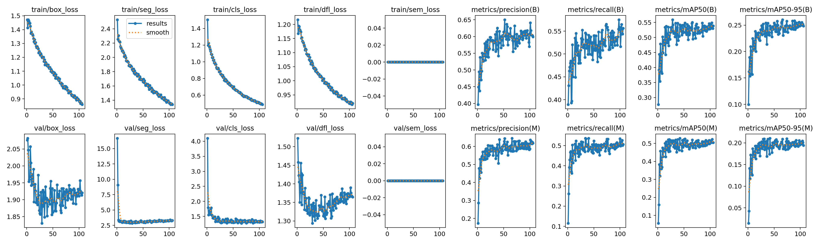
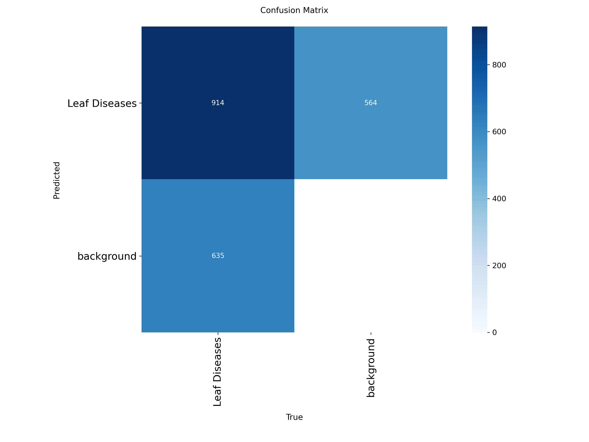
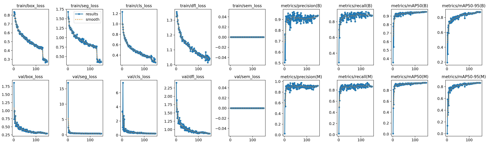
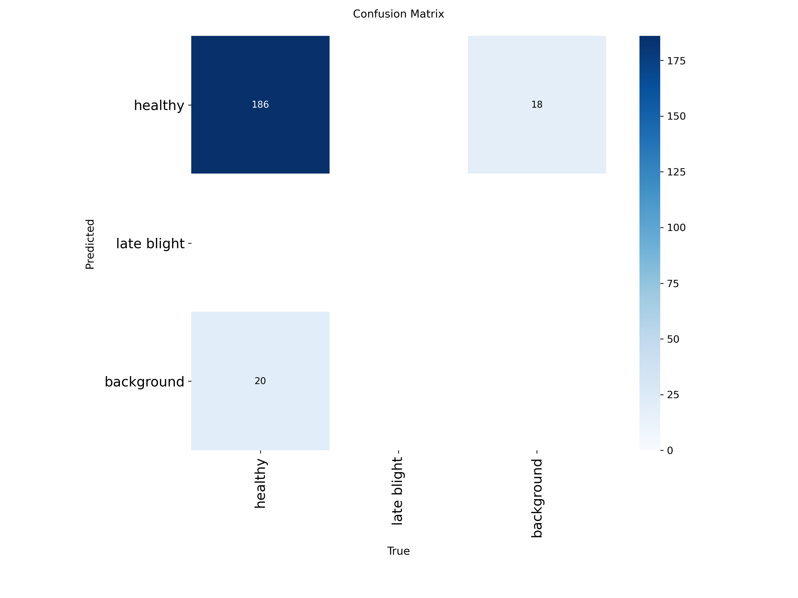
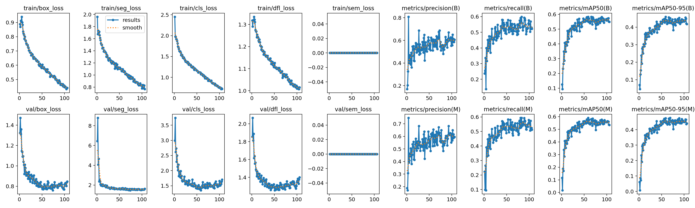
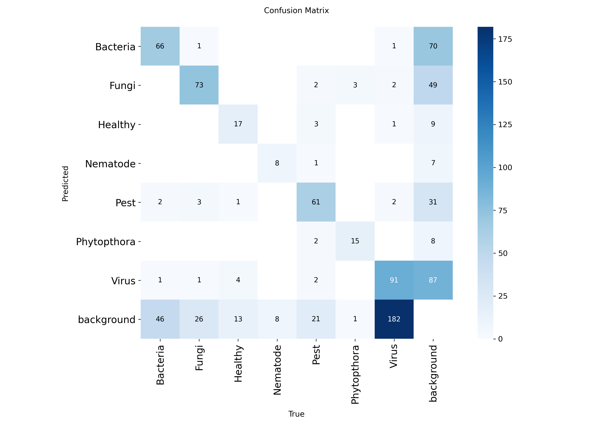

# leaves Analyze With Yolo Segmentation

## Short description
Application for detecting leaf's masks from image and then detecting leaf diseases on each leaf - the goal is to calcuate diseased percantage of each leaf. Datasets used in this project are based on potato leaves and that fact alone is limitation.

[](https://www.youtube.com/watch?v=xJZTdFCBmp0)

## Setup
  - ```pip install -r requirements.txt```

## Packages
```
numpy==2.4.3
ultralytics==8.4.19
opencv-python==4.11.0.86
opencv-python-headless==4.11.0.86
sahi==0.11.34
fastapi==0.134.0
flask==3.1.3
keras==3.13.2
numpy==2.4.3
pydantic==2.12.5
requests==2.32.5
tensorflow==2.21.0
uvicorn==0.42.0
wtforms==3.2.1
```

## Datasets
Segmentation datasets come from Roboflow.

- **leaf-disease-segmentation-yguau** - dataset with spots marked on the leaves.
  - *Classes*: leaf disease
  - *Subdatasets*:
    - **train**: 1320 images
    - **validation**: 117 images
    - **test**: 31 images.

- **potato-leaf-disease-in-uncontrolled-environment** - dataset containing potato leaves photos with different diseases (whole leaves, not just spots).  
  - *Classes*: Bacteria, Fungi, Healthy, Nematode, Pest, Phytopthora, Virus
  - *Subdatasets*:
    - **train**: 2343 images
    - **validation**: 296 images
    - **test**: 280 images.

- **agrobotanix** - contains images of both healthy potato leaves (whole leaves) and spots on the leaves (just parts of the leaves). I used this dataset just for detecting leaves, so I've filtered out images with just spots. 
  - *Classes original*: healthy, late blight
  - *Classes filtered*: healthy
  - *Subdatasets original*:
    - **train**: 2343 images
    - **validation**: 296 images
    - **test**: 280 images.
  - *Subdatasets filtered*:
    - **train**: 934 images
    - **validation**: 155 images
    - **test**: 176


## Models and it's training results

### Metrics
**box loss** - the lower the better - where and how big is the bbox.

**seg loss** - the lower the better - how well the predicted mask matches the object's shape, pixel by pixel.

**cls loss** - the lower the better - object classification.

**dfl loss** - the lower the better - Distribution Focal Loss, how sharply defined the edge is.

**sem loss** - the lower the better - semantic segmentation loss, an auxiliary loss that assigns a class to every pixel of the whole image (not to individual objects). It only helps the model learn during training.

*train/* losses are calculated on the training set, *val/* losses on the validation set. If train losses keep falling while val losses start rising, the model is overfitting.

**(B)** - metrics calculated for bounding boxes (Box).

**(M)** - metrics calculated for segmentation masks (Mask). IoU is based on the overlap of mask pixels instead of box areas, so it's stricter: the shape has to match, not just the frame.

**precision (B/M)** - the larger the better - what fraction of detections (boxes / masks) were correct.

**recall (B/M)** - the larger the better - what fraction of objects were detected (boxes / masks).

**mAP (B/M)** - the larger the better - mean Average Precision, based on *IoU* (Intersection over Union - the area of the intersection divided by the total area. 1.0 indicates perfect coverage, 0 indicates no overlap). *AP* is the area under the Precision-Recall curve. It shows how well the model balances precision and recall at different confidence thresholds:
  - *mAP50* - IoU 0.5
  - *mAP50-95* - average over IoUs from 0.5 to 0.95

**lr/pg0, lr/pg1, lr/pg2** - learning rate for the three parameter groups of the model (pg0 - biases, pg1 - weights, pg2 - BatchNorm weights). They differ only during warmup in the first epochs, then they decrease together according to the scheduler.

### disease_model_s_1
Small Yolov11 model trained on *leaf-disease-segmentation-yguau* dataset for detecting diseased spots.

**Training**


**Confusion Matrix**


### disease_model_s_2
I forgot how lmao

### leaves_model_agrobotanix_s_1
Small Yolov11 model trained on *agrobotanix* dataset for detecting leaves.

**Training**


**Confusion Matrix**


### leaves_model_agrobotanix_s_1
Medium Yolov11 model trained on *agrobotanix* dataset for detecting leaves.

**Training**


**Confusion Matrix**


### leaves_model_s_1
Small Yolov11 model trained on *potato-leaf-disease-in-uncontrolled-environment* dataset for detecting leaves but this one has more classes than agrobotanix.

**Training**


**Confusion Matrix**



## Configuration
Sits in **config.py**, it contains the following sections:
 - Overall
 - Folders
 - SAHI MODEL PARAMS
 - YOLO Model
 - LOGGER
 - API
 - WEB APP


## yolo_segm.py
This file is the basic module for using yolo-segm. It handles both regular Yolo and SAHI.

The most important methods are:
 - **segment_with_yolo** - basic method for getting detections with it's mask using regular yolo. Protip: don't set plot=True if you don't need that.
 - **segment_with_sahi** - the same as above, but for SAHI.
 - **normalize_results** - method for transforming raw detection data into some more nice.
 - **normalize_sahi_results** - method for transforming raw detection data (but sahi) into some more nice.

### Example
```python
import cv2
from yolo_segm import YoloSegmentation

ys = YoloSegmentation(
    model_path=r"path to model"
)

img = cv2.imread(f"{Config.IMAGES_FOLDER}/kantong_sakit_5.png")
res, vis = ys.segment_with_yolo(
    images=[img],
    plot=True # cuz i wanna see detection sar
)

cv2.imshow("res", vis[0])
cv2.waitKey(0)
```

## leaf_disease_analyzer.py
Core module of this project, here we're using `yolo_segm.py` to detect stuff and actually process the data and by that I mean using both leaf detecting and disease detecting models, calculating what percentage of each leaf on the image is diseased, filtering out too large objects based on their mask sum and displaying detections nicely.

The most important method here is **process_image** cuz you know, everything happens there, other methods are just helping. I'm not gonna explain params and outputs for each method because you can basically read the fucking code but here I write down something because it's wild a bit. We're using here 2 yolo models, each of them can use regular yolo and sahi, that's why there are few types of subconfiguration classes:
 - **SahiConfig** - for sahi
 - **YoloConfig** - for yolo
 - **DetectionConfig** - here we gather configuration for both yolo and sahi
 - **ProcessImageConfig** - full configuration, it has stuff related to models (DetectionConfig) but also unrelated like color of the bboxes.

```python
class ModelInitError(Exception):
    pass

@dataclass
class SahiConfig:
    use_sahi: bool = False
    conf: float = .1
    slice_height: int = 240
    slice_width: int = 240
    overlap_height_ratio: float = 0.3
    overlap_width_ratio: float = 0.3
    match_threshold: float = 0.4

@dataclass
class YoloConfig:
    conf: float = .1
    iou: float = .1

@dataclass
class DetectionConfig:
    sahi: SahiConfig = field(default_factory=SahiConfig)
    yolo: YoloConfig = field(default_factory=YoloConfig)

@dataclass
class ProcessImageConfig:
    pad: float = 0.06
    alpha: float = 0.5
    draw_color: tuple[int, int, int] = (200, 0, 50)
    filter_lt_px: int = 50000

    leaf: DetectionConfig = field(default_factory=DetectionConfig)
    disease: DetectionConfig = field(default_factory=DetectionConfig)
```

### Example
```python
config = ProcessImageConfig(
    pad=0.06,
    filter_lt_px=50000,
    leaf=DetectionConfig(
        sahi=SahiConfig(
            use_sahi=False,
            conf=0.15,
            slice_height=240
        ),
        yolo=YoloConfig(
            conf=0.2,
            iou=0.3
            )
        ),
        disease=DetectionConfig(
            sahi=SahiConfig(
                use_sahi=False,
                conf=0.15,
                slice_height=240
            ),
        ),
    )
lda = leavesDiseaseAnalyzer()
img = cv2.imread(r"img path")
# img2 = cv2.imread(r"img path")
(draw_imgs, gowienkos), proc_time = lda.process_image(images=[img], config=config)
print(proc_time)

for draw_img, gowienko in zip(draw_imgs, gowienkos):
    cv2.imshow("res", draw_img)
    cv2.waitKey(0)

    for i, gow in enumerate(gowienko):
        print(gow.leaf_id, gow.conf, gow.class_name, gow.diseased_area_perc)
        cv2.imshow(f"res{i}", gow.img_draw)
        cv2.waitKey(0)
```

## API
Well, api using fast-api.

### On init
On init, it sets up models, logging and api itself, but I've faced some bug in which *UploadFile* from fastapi was acting like string field in Swagger, so I had to do some bs ai generated workaround using **custom_openapi** method (never seen sth like that and I didn't want to spend too much time on googling this shit - probably some issues with versions). 

### Endpoints
 - **alive** - */* - boring
 - **health_check** - */health* - boring
 - **process** - */process* - main endpoint, it takes **images** (list[np.ndarray] = Depends(load_images)) and **config** (rememeber this wild config? config: ProcessImageConfigModel = Depends(parse_config)). Images are being prepared and error are handled with load_images function, the same for the configuration which is validated by parse_config function. It returns processing time, number of items, images with with visualized detections and leaves data (check out response model for the endpoint). If you provide empty **config** it will just use default parameters.

### Run api
```bash
python .\api\run.py
```

### Example
See test_request.py

## API
Web application using Flask.

### On init
On init, it sets up logging, app itself, checks api connection.

### Forms
All fields for ourr big ass configuration.

### Endpoints
 - **health_check** - */health* - checks api connection using **check_api_connection** function.
 - **home** - */* - main endpoint, gathers values from form, sends request to api (it uses **require_api_connection** decorator, check that), images from responsess are saved to the **\static\temp_uploads** folder and they can be deleted with **delete_temp_files.py**, adding crone would be nice (for production you need something else).

### Run web app
```bash
python .\webapp\run.py
```

I guess that's it, I could write much more details but nobody will read it anyways, but in the same time I don't wanna put another ai bs slop as readme.

https://www.youtube.com/watch?v=XhrIxZ6yv_w


